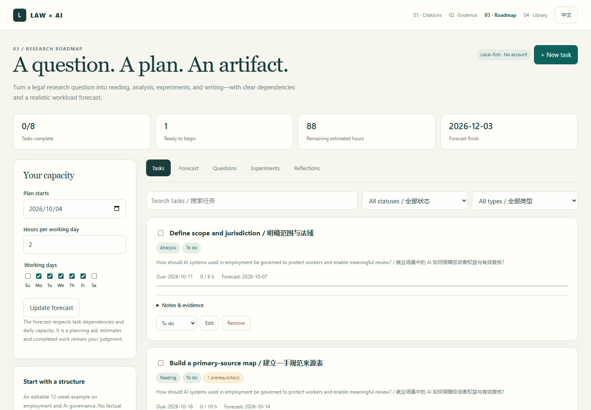

# 03 · Research Roadmap / 研究路线图

A local-first planner that connects legal research questions to reading, analysis, experiments, and concrete artifacts.

**[Open the tool](https://josephsun1854.github.io/03-research-roadmap/)** · **[Research workspace](https://josephsun1854.github.io/JosephSun1854/)** · [Methods](docs/methods.md)



## Why this exists

AI governance research mixes doctrinal analysis, literature synthesis, and increasingly empirical audits. A generic task list rarely records how a task advances a research question, what must happen first, or where the resulting evidence lives. This tool keeps those connections visible.

It includes an editable example about employment and AI governance, reflecting the intersection of social law and AI regulation. The example supplies a planning structure, not a legal finding.

## What you can do

- Define research questions, scope, jurisdiction, and working hypotheses.
- Link reading, analysis, experiments, writing, and application tasks to those questions.
- Record estimates, actual hours, deadlines, dependencies, and artifact links.
- Forecast unfinished work against a weekly schedule and daily time capacity; inspect potential missed deadlines.
- Keep experiment records with a model or method, dataset version, baseline, metrics, observations, and a reproducible artifact.
- Write dated research reflections about progress, conflicting evidence, obstacles, and next steps.
- Export a complete JSON backup, a Markdown research report, spreadsheet-safe CSV, or all-day calendar deadlines.
- Import a metadata reading list exported by [04 · Literature Library](https://github.com/JosephSun1854/04-literature-library) to create reading tasks.
- Switch between English and Chinese. No account, backend, telemetry, or model service is required.

## Quick start

1. Open the tool and set your start date, working days, and realistic daily capacity.
2. Create a research question, then tasks with deliverables and estimates.
3. Connect prerequisite tasks; cycles and missing dependencies are rejected.
4. Use the forecast to revise scope or capacity, rather than treating its finish date as a promise.
5. Record artifacts and export backups periodically.

The **Load example plan** button offers an editable 12-week structure. It asks before replacing existing work. Library reading lists add tasks; validated Roadmap backups replace the workspace only after confirmation.

## Method and limits

The forecast is a deterministic, single-person scheduling heuristic. At each step it chooses the earliest deadline among tasks whose predecessors are completed or scheduled, then allocates the remaining estimated hours to working days. It does not solve an optimal scheduling problem, account for interruptions, or infer the quality of research. A two-year horizon bounds work and reports tasks that cannot be scheduled.

This is infrastructure for legal and AI research. It **does not run an AI model**, generate research findings, evaluate legal validity, or assert that an uploaded artifact supports a claim. Experiment fields are your own records.

## Data and privacy

Research data is stored in this browser's `localStorage`. Different browsers, devices, and site origins have separate workspaces. Clearing site data removes it. JSON backups contain the actual research notes you enter; choose where you store or share them. A failed storage write keeps the previous workspace and reports that the change was not saved.

No content is uploaded by this tool. Opening a source/artifact link visits that external site normally. Calendar exports include titles and notes; check them before sharing.

## Run and verify locally

No build or dependency installation is needed. Serve this directory rather than opening an ES module directly via `file://`:

```sh
python -m http.server 8033
# Open http://localhost:8033
node --test tests/*.test.mjs
node --check core.mjs
node --check app.mjs
```

The tests exercise impossible dates, leap years, dependency cycles, workload allocation, bounded forecasts, reading-list imports, atomic validation, safe URLs, spreadsheet formula prefixes, and UTF-8 calendar folding. GitHub Actions repeats the core checks on pushes and pull requests.

An optional [browser integration check](scripts/browser-check.mjs) covers persistence, form editing, rejected imports, reading-list transfer, unreadable-data recovery, focus restoration, and mobile layout. With Playwright and its browser available, run `node scripts/browser-check.mjs` against the local server. `TEST_BASE_URL` selects another server and `BROWSER_CHANNEL=chrome` or `msedge` selects an installed browser. These are test-only dependencies; the application still needs no installation.

## 中文说明

研究路线图把“研究问题—任务—证据与成果”连接起来，适用于社会法学、人工智能规制及可复现法学 AI 实验的进度管理。

可以记录阅读、分析、实验、写作与申请任务，设置截止日期、前置依赖、预计和实际工时，并按每周研究日与每日容量预测完成时间。另设实验记录与周回顾，便于保留研究方法、相反证据和研究局限。文献库的阅读清单可直接转换成阅读任务。

预测使用确定性规则，不调用模型，也不产生法律结论。示例仅提供可编辑的研究结构。所有记录保存在当前浏览器，支持 JSON、Markdown、CSV 和日历导出；清除网站数据前请先备份。导入将先校验，确认后才替换已有数据。

## License

[MIT](LICENSE). Part of the [Law × AI research tools](https://github.com/JosephSun1854).
